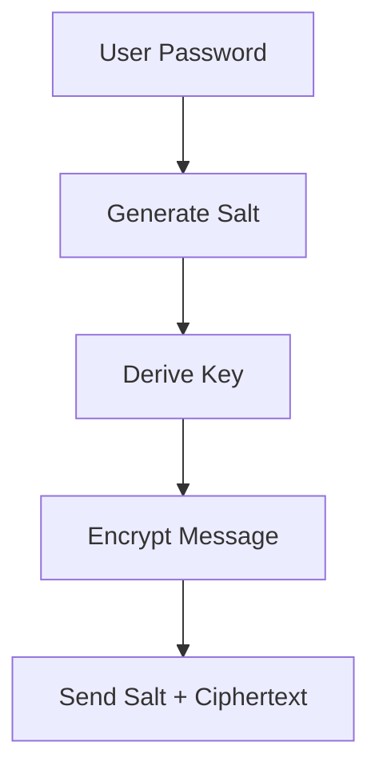
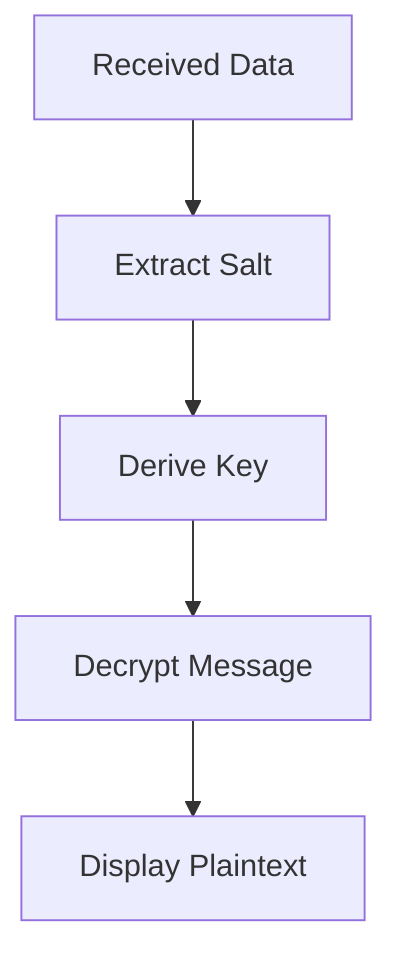

# Secure Two-Way Chat Application 🔐

 

A secure end-to-end encrypted chat application for private two-way communication over TCP sockets.

## Features ✨

- 🔒 **End-to-End Encryption** using Fernet (AES-128 CBC + HMAC)
- 🔑 Password-based key derivation with PBKDF2HMAC
- 🌐 Simple host-client model over TCP
- ⚡ Real-time messaging with threading
- 🎨 User-friendly terminal interface with emojis
- 🛡️ Secure salt generation for each session
- 🚦 Graceful error handling

## Installation 📦

1. Ensure you have Python 3.6+ installed
2. Install required dependencies:

```bash
pip install cryptography
```

## Usage 🚀

### Host Mode (Start a chat room)

```bash
python chat.py
? Are you host or join? [host/join]: host
? Enter room password: [your-secret-password]
? Enter port number (e.g., 65432): 65432
```

### Client Mode (Join a chat)

```bash
python chat.py
? Are you host or join? [host/join]: join
? Enter room password: [your-secret-password]
? Enter port number (e.g., 65432): 65432
? Enter host IP to connect: [host-ip-address]
```

## How It Works ⚙️

### Encryption Process
1. Generates random 16-byte salt per session
2. Derives encryption key using PBKDF2HMAC (100,000 iterations)
3. Encrypts messages with Fernet (AES-128 CBC + HMAC)
4. Prepends salt to ciphertext for secure transmission



### Decryption Process
1. Extracts salt from received message
2. Re-derives same key using password + salt
3. Verifies HMAC and decrypts message



## Security Notes 🔐

- Each session uses unique salt to prevent pattern analysis
- PBKDF2HMAC with 100,000 iterations slows brute-force attacks
- Fernet provides message integrity through HMAC
- Incorrect passwords fail decryption immediately

## Example Session 💬

**Host Terminal:**
```
🔐 Secure Two-Way Chat Room
✅ Connected with 192.168.1.100
🧑‍💻 You: Hello there!
📩 Friend: Hi! How are you?
```

**Client Terminal:**
```
🔐 Secure Two-Way Chat Room
✅ Connected to 192.168.1.10:65432
📩 Friend: Hello there!
🧑‍💻 You: Hi! How are you?
```

## Limitations ⚠️

- Supports only 1:1 connections
- No chat history persistence
- No password strength enforcement
- Basic TCP socket without timeout handling

## Future Improvements 🚧

- [ ] Multi-client chat rooms
- [ ] Encrypted chat history
- [ ] Password strength meter
- [ ] GUI interface
- [ ] Connection timeout handling

## License 📄

[MIT License](License) - Free for personal and commercial use

---

> **Note**: Always use strong passwords and keep them secret! This tool provides security but depends on proper usage.
